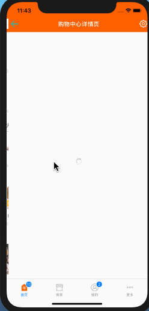

# RNDemo(RN0.57.3+ES6)

`QQ: 1512450002@qq.com  欢迎沟通交流`

`包含基本的界面传值和回传,跳转,加载网页等`

## 增加RN跳原生,原生跳RN界面,以及RN和原生跳同一个RN界面,返回键的处理

`RN跳原生`

```
RN页面
1.导入NativeModules模块
import {
    NativeModules
} from 'react-native';
2.创建变量
var nativeModule = NativeModules.OpenNativeModule;
3.点击事件
onPress={this.jumpToNative}
4.跳转到原生界面
jumpToNative() {
    nativeModule.openNativeVC()
}

iOS原生界面
1.创建桥接类.h,遵守RCTBridgeModule协议

#import <Foundation/Foundation.h>
#import <React/RCTBridgeModule.h>


@interface OpenNativeModule : NSObject <RCTBridgeModule>

@end

#import "OpenNativeModule.h"
#import "AppDelegate.h"
#import "ZYViewController.h"

@implementation OpenNativeModule

RCT_EXPORT_MODULE();

RCT_EXPORT_METHOD(openNativeVC) {
    dispatch_async(dispatch_get_main_queue(), ^{
        AppDelegate *delegate = (AppDelegate *)([UIApplication sharedApplication].delegate);
        UINavigationController *rootNav = delegate.navigationController;
        //要跳转的原生界面
        ZYViewController *nativeVC = [[ZYViewController alloc] init];
        [rootNav pushViewController:nativeVC animated:YES];
    });
}

@end

2.原生界面
- (void)viewWillAppear:(BOOL)animated {
    [super viewWillAppear:animated];
    self.navigationController.navigationBar.hidden = NO;
}

- (void)viewWillDisappear:(BOOL)animated {
    [super viewWillDisappear:animated];
    self.navigationController.navigationBar.hidden = YES;
}

```

`RN和原生跳转同一个RN界面`

```
1.在index.js同目录下重新创建一个js文件NewIndex.js,引用需要跳转到的RN界面的ZYHomeShopCenterDetail.js

import React, { Component } from 'react';

import {
    AppRegistry,
} from 'react-native';

import ShopCenterDetail from "./js/News/ZYHome/ZYHomeShopCenterDetail";

export default class RNDemo extends Component {

    constructor(props) {
        super(props);
        this.state = {
            selectedTabBarItem: "contacts"
        };
    };

    render() {
        return (
            <ShopCenterDetail/>
        );
    }
}

AppRegistry.registerComponent('RNDemo', () => RNDemo);


2.创建新的原生界面引用需要跳转到的RN界面,用来展示此RN界面(RN跳RN就不用关心了)
#import "ZYRNViewController.h"
#import <React/RCTRootView.h>

@interface ZYRNViewController ()

@end

@implementation ZYRNViewController

- (void)viewDidLoad {
    [super viewDidLoad];

    NSURL *url = [NSURL URLWithString:@"http://localhost:8081/NewIndex.bundle?platform=ios&dev=true"];
    RCTRootView *rootView = [[RCTRootView alloc] initWithBundleURL:url moduleName:@"RNDemo" initialProperties:nil launchOptions:nil];
    self.view = rootView;
}

- (void)viewWillAppear:(BOOL)animated {
    [super viewWillAppear:animated];
    self.navigationController.navigationBar.hidden = YES;
}

- (void)viewWillDisappear:(BOOL)animated {
    [super viewWillDisappear:animated];
    self.navigationController.navigationBar.hidden = NO;
}

@end

3.原生跳转到此RN界面
- (void)viewDidLoad {
    [super viewDidLoad];
    self.title = @"原生界面";

    self.navigationItem.rightBarButtonItem = [[UIBarButtonItem alloc] initWithTitle:@"原生2RN" style:UIBarButtonItemStyleDone target:self action:@selector(jumpToNewRNPage)];
}

- (void)jumpToNewRNPage {
    [self.navigationController pushViewController:[[ZYRNViewController alloc] init] animated:YES];
}

4.RN跳转到此RN界面
//跳转到二级页面
pushToShopCenterDetail(data) {
    if (data != null) {
        this.props.navigator.push(
            {
                component: ShopCenterDetail,
                title: "购物中心详情页",
                passProps: {
                    "url": this.detalWithUrl(data),
                    "isFromNative": false
                }
            }
        );
    }
}

5.新的RN页面返回按钮的处理
//增加属性标识,是来源于RN界面还是来源于原生界面
static defaultProps = {
    isFromNative: null
}

//返回判断处理,RN跳转来源和原生跳转来源
popToView() {
    if (this.props.isFromNative !== null) {
        this.props.navigator.pop()
    } else {
        nativeModule.popToViewController()
    }
}

6.新的RN界面返回的原生界面通信,在OpenNativeModule增加通信方法
RCT_EXPORT_METHOD(popToViewController) {
    dispatch_async(dispatch_get_main_queue(), ^{
        AppDelegate *delegate = (AppDelegate *)([UIApplication sharedApplication].delegate);
        [delegate.navigationController popViewControllerAnimated:YES];
    });
}


```

## 效果图

<p align="center" >

</p>

<p align="center" >

</p>
