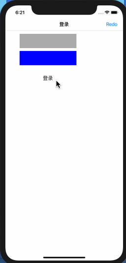

# RNDemo(RN0.57.3+ES6)

`QQ: 1512450002@qq.com  欢迎沟通交流`

`包含基本的界面传值和回传,跳转,加载网页等`

## 增加RN跳原生,原生跳RN界面,以及RN和原生跳同一个RN界面,返回键的处理

### 1. `RN跳原生`

```
RN页面
1.导入NativeModules模块
import {
    NativeModules
} from 'react-native';
2.创建变量
var nativeModule = NativeModules.OpenNativeModule;
3.点击事件
onPress={this.jumpToNative}
4.跳转到原生界面
jumpToNative() {
    nativeModule.openNativeVC()
}

iOS原生界面
1.创建桥接类.h,遵守RCTBridgeModule协议

#import <Foundation/Foundation.h>
#import <React/RCTBridgeModule.h>


@interface OpenNativeModule : NSObject <RCTBridgeModule>

@end

#import "OpenNativeModule.h"
#import "AppDelegate.h"
#import "ZYViewController.h"

@implementation OpenNativeModule

RCT_EXPORT_MODULE();

RCT_EXPORT_METHOD(openNativeVC) {
    dispatch_async(dispatch_get_main_queue(), ^{
        AppDelegate *delegate = (AppDelegate *)([UIApplication sharedApplication].delegate);
        UINavigationController *rootNav = delegate.navigationController;
        //要跳转的原生界面
        ZYViewController *nativeVC = [[ZYViewController alloc] init];
        [rootNav pushViewController:nativeVC animated:YES];
    });
}

@end

2.原生界面
- (void)viewWillAppear:(BOOL)animated {
    [super viewWillAppear:animated];
    self.navigationController.navigationBar.hidden = NO;
}

- (void)viewWillDisappear:(BOOL)animated {
    [super viewWillDisappear:animated];
    self.navigationController.navigationBar.hidden = YES;
}

```

### 2. `RN和原生跳转同一个RN界面`

```
1.在index.js同目录下重新创建一个js文件NewIndex.js,引用需要跳转到的RN界面的ZYHomeShopCenterDetail.js

import React, { Component } from 'react';

import {
    AppRegistry,
} from 'react-native';

import ShopCenterDetail from "./js/News/ZYHome/ZYHomeShopCenterDetail";

export default class RNDemo extends Component {

    constructor(props) {
        super(props);
        this.state = {
            selectedTabBarItem: "contacts"
        };
    };

    render() {
        return (
            <ShopCenterDetail/>
        );
    }
}

AppRegistry.registerComponent('RNDemo', () => RNDemo);


2.创建新的原生界面引用需要跳转到的RN界面,用来展示此RN界面(RN跳RN就不用关心了)
#import "ZYRNViewController.h"
#import <React/RCTRootView.h>

@interface ZYRNViewController ()

@end

@implementation ZYRNViewController

- (void)viewDidLoad {
    [super viewDidLoad];

    NSURL *url = [NSURL URLWithString:@"http://localhost:8081/NewIndex.bundle?platform=ios&dev=true"];
    RCTRootView *rootView = [[RCTRootView alloc] initWithBundleURL:url moduleName:@"RNDemo" initialProperties:nil launchOptions:nil];
    self.view = rootView;
}

- (void)viewWillAppear:(BOOL)animated {
    [super viewWillAppear:animated];
    self.navigationController.navigationBar.hidden = YES;
}

- (void)viewWillDisappear:(BOOL)animated {
    [super viewWillDisappear:animated];
    self.navigationController.navigationBar.hidden = NO;
}

@end

3.原生跳转到此RN界面
- (void)viewDidLoad {
    [super viewDidLoad];
    self.title = @"原生界面";

    self.navigationItem.rightBarButtonItem = [[UIBarButtonItem alloc] initWithTitle:@"原生2RN" style:UIBarButtonItemStyleDone target:self action:@selector(jumpToNewRNPage)];
}

- (void)jumpToNewRNPage {
    [self.navigationController pushViewController:[[ZYRNViewController alloc] init] animated:YES];
}

4.RN跳转到此RN界面
//跳转到二级页面
pushToShopCenterDetail(data) {
    if (data != null) {
        this.props.navigator.push(
            {
                component: ShopCenterDetail,
                title: "购物中心详情页",
                passProps: {
                    "url": this.detalWithUrl(data),
                    "isFromNative": false
                }
            }
        );
    }
}

5.新的RN页面返回按钮的处理
//增加属性标识,是来源于RN界面还是来源于原生界面
static defaultProps = {
    isFromNative: null
}

//返回判断处理,RN跳转来源和原生跳转来源
popToView() {
    if (this.props.isFromNative !== null) {
        this.props.navigator.pop()
    } else {
        nativeModule.popToViewController()
    }
}

6.新的RN界面返回的原生界面通信,在OpenNativeModule增加通信方法
RCT_EXPORT_METHOD(popToViewController) {
    dispatch_async(dispatch_get_main_queue(), ^{
        AppDelegate *delegate = (AppDelegate *)([UIApplication sharedApplication].delegate);
        [delegate.navigationController popViewControllerAnimated:YES];
    });
}


```

### 3. `RN页面向原生界面传值,原生界面回调给RN数据`

```
#import "ViewController.h"

@interface ZYLoginViewController : UIViewController

@property (nonatomic, copy)  void(^loginBlock) (NSArray* resultArr);

@end
```

```
RCT_EXPORT_METHOD(loginState:(NSString *)state callback:(RCTResponseSenderBlock)callback) {
    dispatch_async(dispatch_get_main_queue(), ^{
        AppDelegate *delegate = (AppDelegate *)([UIApplication sharedApplication].delegate);
        ZYLoginViewController *login = [[ZYLoginViewController alloc] init];
        UINavigationController *nav = [[UINavigationController alloc] initWithRootViewController:login];
        [delegate.navigationController presentViewController:nav animated:YES completion:nil];
        login.loginBlock = ^(NSArray *resultArr) {
            callback(@[[NSNull null], resultArr]);
        };
    });
}
```

```
- (void)dismiss {
    [self dismissViewControllerAnimated:YES completion:nil];
}

- (void)doLogin {
    self.loginBlock(@[@"zhouyu", @"123456"]);
    [self dismiss];
}
```

```
//跳转到原生界面
//loginState:(NSString *)state callback:(RCTResponseSenderBlock)callback
jumpToNativeLogin() {
    nativeModule.loginState(
        "需要调起登录",
        (error,events) => {
            console.log(events);
            alert(events);
        }
    )
}
```

### 4. 原生页面向RN页面传值

[React Native中文网: 和原生端通信](https://reactnative.cn/docs/communication-ios/) 

[React Native中文网: 回调函数及通信](https://reactnative.cn/docs/native-modules-ios/)

`主要分两种情况: 一种是原生界面向下级RN界面传值; 另一种是原生界面向上级RN界面传值`
#### 4.1 原生界面向下级RN界面传值

<font color=red>这种情况不能用`NativeEventEmitter`结合iOS的通知来实现传值,因为通知是现有监听者再有发送者,向下级RN界面传值,这种方式有可能下级RN页面还没加载出来,通知就已经发送了,导致下级RN页面获取不到值</font>

`可以利用加载js的budle文件时,利用initialProperties参数进行传值`

```
NSDictionary *properties = @{@"name": @"zhangsan"};
NSURL *url = [NSURL URLWithString:@"http://localhost:8081/NewIndex.bundle?platform=ios&dev=true"];
RCTRootView *rootView = [[RCTRootView alloc] initWithBundleURL:url moduleName:@"RNDemo" initialProperties:properties launchOptions:nil];
self.view = rootView;
```

#### 4.2 原生界面向上级RN界面传值
<font color=red>此种情况可以使用RN的`NativeEventEmitter`结合iOS的通知来实现传值</font>

1. 原生界面创建事件传递的module类,继承RCTEventEmitter,遵守RCTBridgeModule协议

```
#import <React/RCTBridgeModule.h>
#import <React/RCTEventEmitter.h>

@interface NativeToRNEventEmitter : RCTEventEmitter <RCTBridgeModule>
+ (instancetype)shareInstance;
@end
```

2. 原生module类实现和重写相关方法

```
#import "NativeToRNEventEmitter.h"

@interface NativeToRNEventEmitter()
@property (nonatomic,assign)BOOL hasListeners;
@end

@implementation NativeToRNEventEmitter

+ (instancetype)shareInstance {
    static NativeToRNEventEmitter *instance;
    static dispatch_once_t onceToken;
    dispatch_once(&onceToken, ^{
        instance = [[NativeToRNEventEmitter alloc] init];
    });
    return instance;
}

RCT_EXPORT_MODULE();

//init方法中使用NSNotificationCenter监听iOS端要发送事件的操作
- (instancetype)init {
    if (self = [super init]) {
        [self registerNotifications];
    }
    return self;
}

//在NSNotification对应的通知方法中将事件发送给RN
- (void)registerNotifications {
    [[NSNotificationCenter defaultCenter] addObserver:self
    selector:@selector(sendCustomEvent:)
    name:@"CustomEventNameNotifation"
    object:nil];
}

- (void)sendCustomEvent:(NSNotification *)notification {
    //    NSString *eventName = notification.userInfo[@"name"];
    if (self.hasListeners) {
        [self sendEventWithName:@"CustomEventName" body:@{@"name": @"东皇大厦"}];
    }
}

#pragma RCTEventEmitter
//重写supportedEvents方法，在这个方法中声明支持的事件名称
- (NSArray<NSString *> *)supportedEvents {
    return @[@"CustomEventName"];
}

// 在添加第一个监听函数时触发
-(void)startObserving {
    self.hasListeners = YES;
}

-(void)stopObserving {
    self.hasListeners = NO;
}

@end
```

3. RN界面: 导入NativeEventEmitter

```
var nativeToRNEventModule = NativeModules.NativeToRNEventEmitter;

componentDidMount() {
    var eventEmitter = new NativeEventEmitter(nativeToRNEventModule);
    this.listener = eventEmitter.addListener("CustomEventName", (result) => {
        alert("监听到通知事件" + result);
        this.setState({
            add: result.name
        });
    })
}

componentWillUnmount() {
    this.listener && this.listener.remove();
}
```


## 效果图

<p align="center" >

</p>

<p align="center" >

</p>

<p align="center" >

</p>

<p align="center" >

</p>
